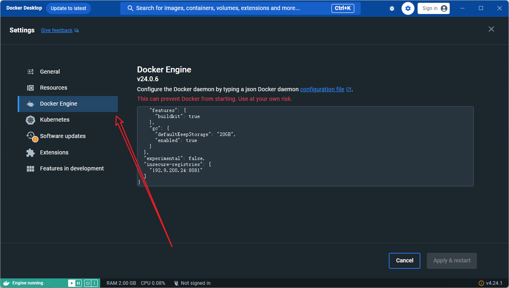
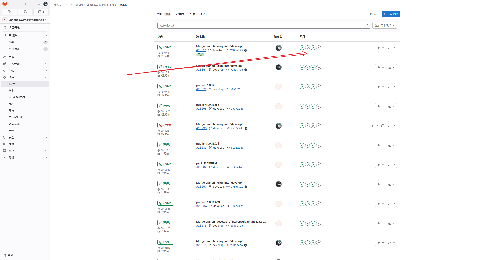
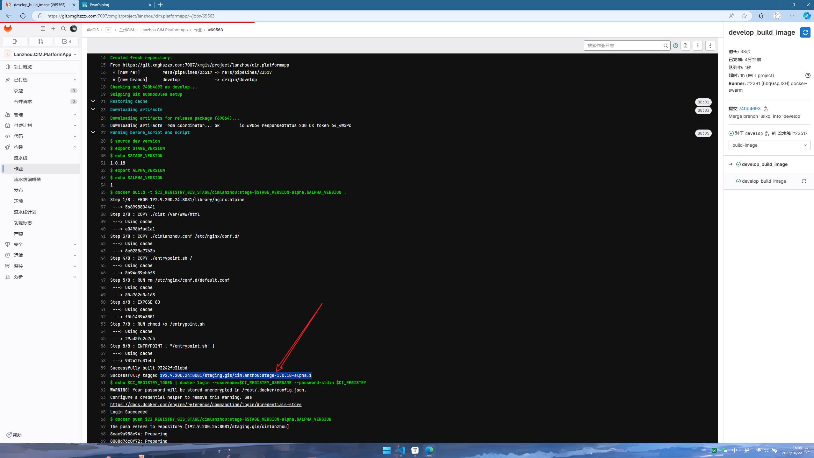
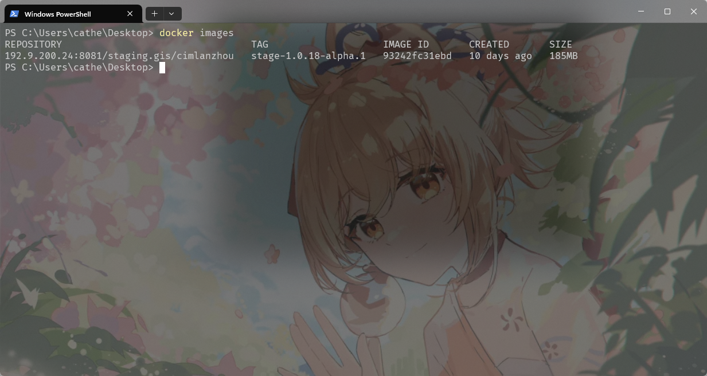
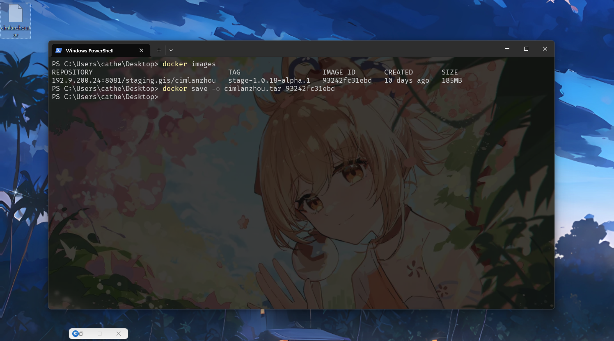

# 兰州部署流程

> 简介:该文档主要应用于兰州项目的部署,并不适用于所有项目 ，所有的操作都是在 window 系统上完成的.
>
> 编写人: 我是糕手
>
> 编写时间:2023 年 10 月 22 日

## 前期准备

- GitLab

- Docker
- 相关的账号
- 网关客户端

## docker 配置

在第一次拉取镜像之前需要先配置**Docker Engine**：



将这一段添加到你的 **Docker Engine**中：

```json
  "insecure-registries": [
    "192.9.200.24:8081"
  ]
```

配置后的样子：

```json
{
  "builder": {
    "features": {
      "buildkit": true
    },
    "gc": {
      "defaultKeepStorage": "20GB",
      "enabled": true
    }
  },
  "experimental": false,
  "insecure-registries": ["192.9.200.24:8081"]
}
```

## 部署过程

### 拉取 docker 镜像

```shell
docker pull 192.9.200.24:8081/staging.gis/cimlanzhou:stage-1.0.18-alpha.1
```

- 这个 **192.9.200.24:8081/staging.gis/cimlanzhou:stage-1.0.18-alpha.1**的地址 可以去**GitLab**上的流水线中查看
- 挑一个构建成功的流水线
  - 
- 

## 保存镜像

- 拉取镜像之后，输出一下 **Docker**镜像，看一下有没有拉取成功。



- 镜像拉取成功，将镜像保存成压缩包，执行下面这个命令

```shell
docker save -o cimlanzhou.tar [镜像id]
```

- 这个镜像 id，具体看你的镜像列表

- 如果保存成功，那么当前目录下就会出现一个压缩包



## 堡垒机操作

- 先登录堡垒机
- 进入到远程的服务器
- 在远程服务器上 docker load 前面压缩包

> // 堡垒机上的操作
> 1、将镜像文件拖入/root 目录
> 2、使用 docker load -i /root/cim
> 3、docker tag 192.9.200.24:8081/staging.gis/cimlanzhou:stage-1.0.14-alpha.1 registry.gis.cn:5000/cimlanzhou:stage-1.0.14-alpha.1(重命名文件名称)
> 4、docker push registry.gis.cn:5000/cimlanzhou:stage-1.0.14-alpha.1
> 5、修改对应的 yml 文件(将里面 images: registry.gis.cn:5000/cimlanzhou:stage-1.0.14-alpha.1)
> 6、kg get pod(查看当前运行的服务)

... 等下次部署的时候完善
